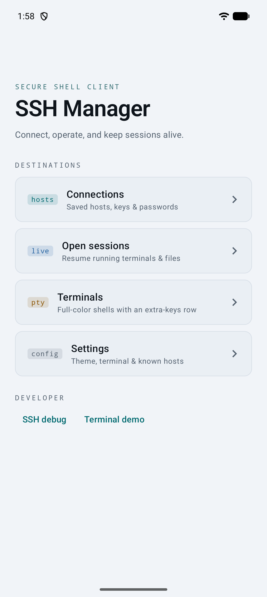
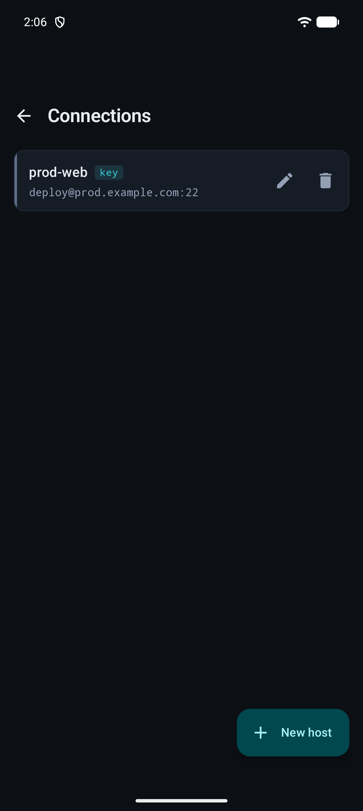
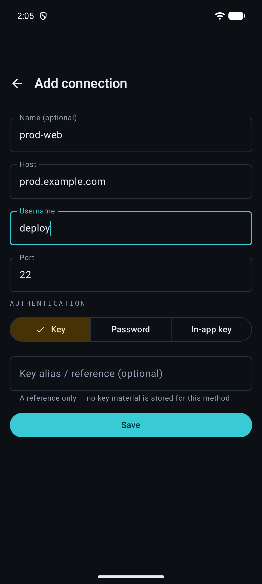
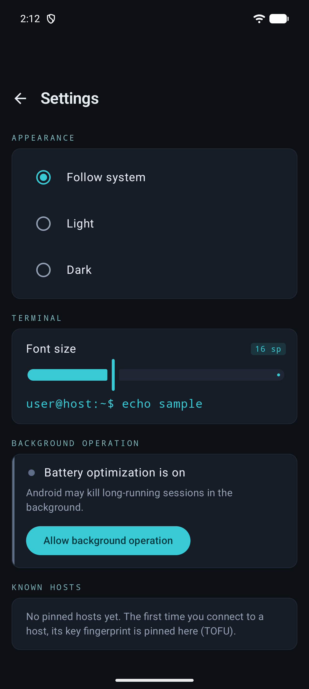
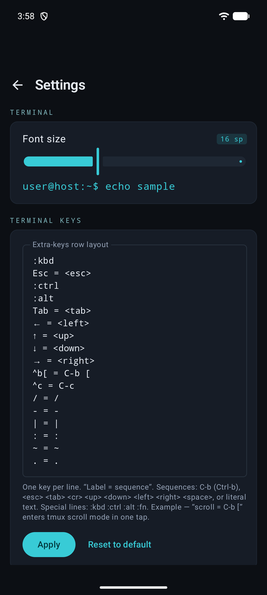
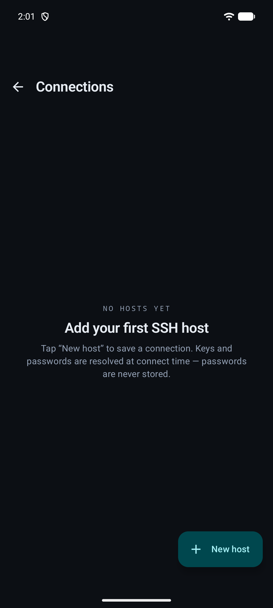

# SSH Manager (Android)

A native Android SSH client with **full-color embedded terminals**, an SFTP file manager, a server dashboard, and persistent sessions that survive backgrounding and network changes. Built with **Kotlin + Jetpack Compose (Material 3)**, a vendored **Termux** terminal emulator, and **sshj** — with all SSH and secret handling isolated behind a foreground service.

> Android port of a cross-platform desktop SSH manager. Same shape, designed for mobile: an extra-keys keyboard row, foreground-service connection lifetime, network-change reconnect, and tmux re-attach.

<p align="center">
  
  
  
</p>

---

## Features

**Terminals**
- Real interactive shells rendered by a native VT100/xterm-256color emulator (true color), so `htop`, `vim`, `docker stats`, and `tail -f` render correctly.
- The shell is driven **directly from the SSH channel** — no local pty is spawned.
- Configurable extra-keys row (Esc, Ctrl, Alt, Tab, arrows, Fn, and custom sequences) for everything a soft keyboard lacks.
- Adjustable font size; window dimensions resync to the remote PTY on layout change.
- Multiple terminals in a tabbed pager, each with its own live connection state.

**Connections**
- Add / edit / delete saved hosts.
- Three auth methods: **private key**, **password**, or an **in-app key vault** (the mobile equivalent of agent auth).
- Optional **opt-in saved password** — stored only as Keystore-encrypted ciphertext and unlocked behind the biometric/device-credential gate at connect time.
- Resilient connect: retries transient failures with jittered backoff, and fails fast on permanent errors (bad auth, missing key, rejected/changed host key).

**Server dashboard**
- One-shot host probe over an `exec` channel: OS, kernel, uptime, CPU / memory / disk, and load.
- tmux session list parsed from the host, with one-tap attach.

**SFTP file manager**
- Browse remote directories, upload via the system file picker (Storage Access Framework), download with progress, rename, `chmod`, `mkdir`, and recursive delete — over a pooled per-connection SFTP channel.

**Sessions & resilience**
- A foreground service owns every SSH connection so sessions stay alive while the app is backgrounded.
- Session metadata is persisted and restored on launch; live tmux sessions can be re-attached.
- Automatic reconnect across WiFi ↔ cellular changes via `ConnectivityManager.NetworkCallback`.

**Security**
- **Passwords and key passphrases are never written to disk in plaintext** — not in the database, preferences, or logs.
- Any saved secret is encrypted with an **Android Keystore** AES-GCM key; only ciphertext + IV are stored, and plaintext exists only transiently in memory.
- **Host-key verification is mandatory**: trust-on-first-use with SHA-256 fingerprints, and a loud, blocking warning if a known host's key changes (MITM protection). A changed key is never auto-trusted.

**Settings**
- Light / dark / follow-system theme.
- Terminal font size with a live preview.
- Editable extra-keys row layout.
- Pinned known-hosts list.
- One-tap battery-optimization exemption so long sessions aren't doze-killed.

---

## Screenshots

| Home | Connections | Add connection |
|---|---|---|
|  |  |  |

| Settings | Extra-keys layout | Empty state |
|---|---|---|
|  |  |  |

---

## Requirements

- **Android 8.0 (API 26)** or newer.
- A device or emulator with network access to your SSH hosts.
- For development: a recent Android Studio, **JDK 17**, and the Android SDK. The build targets **AGP 9.2 / Kotlin 2.3 / compileSdk 37**.

---

## Building from source

```bash
git clone <repo-url>
cd lt-ssh-manager-android

# Build a debug APK (no signing config required)
./gradlew assembleDebug

# Install on a connected device / running emulator
./gradlew installDebug

# Run the JVM unit tests
./gradlew test

# Run instrumented tests (needs a device/emulator)
./gradlew connectedAndroidTest
```

The debug APK is written to `app/build/outputs/apk/debug/`.

### Release builds

Release signing is read from a **gitignored** `keystore.properties` at the project root:

```properties
storeFile=release.keystore
storePassword=…
keyAlias=…
keyPassword=…
```

When that file is absent (e.g. on a fresh clone or CI), the release build simply skips the signing config — neither the keystore nor its passwords are ever committed. Set `sdk.dir` in a local `local.properties` (also gitignored) if Android Studio doesn't create it for you.

---

## Architecture

The desktop original isolated all SSH/secret handling in a separate process. On Android the equivalent is a **foreground service** that owns every SSH connection, plus a strict layering rule: **only the `ssh/` layer imports the SSH library, and the UI never holds raw key material.**

```
UI (Compose) ──▶ ViewModels ──▶ Repositories ──▶ SshForegroundService ──▶ ssh/ (sshj)
                                      │
                              data/crypto (Keystore)        data/db (Room)
```

- **`ui/`** — Jetpack Compose (Material 3), one screen per feature, state hoisted into ViewModels exposing `StateFlow<UiState>`.
- **`ssh/`** — the only package that imports sshj: connection lifecycle, the read loop, SFTP sessions, TOFU host-key verification, error classification, and backoff/retry.
- **`service/`** — a typed (`specialUse`) foreground service that keeps connections alive while backgrounded and recovers after process death.
- **`terminal/`** — the vendored Termux terminal view driven directly from the SSH shell channel, plus extra-keys handling and font/geometry logic.
- **`dashboard/`** — the one-shot probe plus parsers for host vitals and the tmux list.
- **`session/`** — persistence, the reconnect policy, and the network-change monitor.
- **`data/`** — Room for connections / known hosts / session metadata, DataStore for preferences, and the Android Keystore crypto wrapper for encrypted secrets.

sshj is blocking, so every channel runs its read loop on `Dispatchers.IO`; no SSH object ever touches the main thread.

---

## Tech stack

| Area | Choice |
|---|---|
| Language / UI | Kotlin, Jetpack Compose (Material 3), Navigation Compose |
| SSH / SFTP | [sshj](https://github.com/hierynomus/sshj) |
| Crypto provider | [BouncyCastle](https://www.bouncycastle.org/) + [EdDSA](https://github.com/str4d/ed25519-java) (for `ed25519` keys) |
| Terminal emulator | Vendored [Termux](https://github.com/termux/termux-app) `terminal-emulator` + `terminal-view` |
| Storage | Room, DataStore (Preferences) |
| Secrets | Android Keystore (AES-GCM) + AndroidX Biometric |
| DI / async | Hilt, Kotlin Coroutines + Flow |
| Testing | JUnit, Apache MINA SSHD (hermetic in-process SSH/SFTP server), Room testing |

---

## Tests

JVM unit tests cover the non-UI logic — the TOFU verifier, backoff/retry and error classification, the dashboard probe parsers (vitals + tmux), SFTP path/delete logic, session-state codec, reconnect policy, and an AES-GCM crypto round-trip. Two integration tests run a real **MINA SSHD** server in-process and exercise the sshj client end-to-end (shell + SFTP). Instrumented tests cover the Room DAOs, repositories, and migrations on an in-memory database.

```bash
./gradlew test                 # JVM unit + integration
./gradlew connectedAndroidTest # instrumented (Room)
```

---

## Roadmap

Implemented:

- [x] Connection manager with key / password / in-app-key auth
- [x] Encrypted secrets (Keystore AES-GCM) + opt-in saved passwords behind a biometric gate
- [x] SSH core with TOFU host-key verification and resilient connect
- [x] Foreground-service connection lifetime
- [x] Full-color terminal + configurable extra-keys row
- [x] Tabbed multi-session terminals
- [x] Server dashboard (host vitals + tmux attach)
- [x] SFTP file manager
- [x] Session persistence, tmux re-attach, and network-change reconnect

Planned:

- [ ] Port forwarding — local (`-L`), remote (`-R`), and dynamic SOCKS5 (`-D`)
- [ ] Remote code editor with syntax highlighting and markdown preview

---

## Security

- Passwords and passphrases are never persisted in plaintext.
- A saved secret is only ever written as Keystore-encrypted ciphertext, decrypted at connect time behind the app's biometric/device-credential gate.
- Host keys are pinned on first use (TOFU, SHA-256). A changed key blocks the connection with an explicit warning rather than silently reconnecting.

If you find a security issue, please open a private report rather than a public issue.

---

## License

Released under the [MIT License](LICENSE).

---

## Contributing

Issues and pull requests are welcome. Two architecture rules are non-negotiable:

1. Only the `ssh/` package may import the SSH library — everything else talks to it through repositories and domain models.
2. Never persist a password or passphrase in plaintext, and never auto-trust a changed host key.
